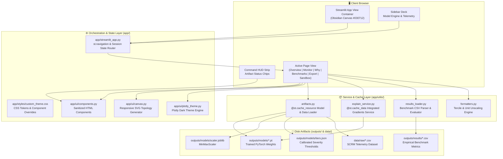
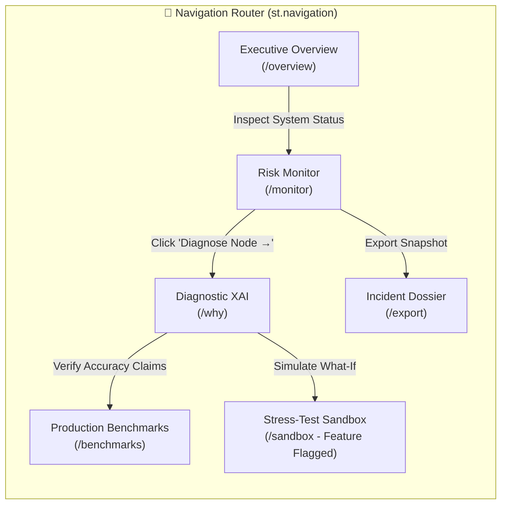
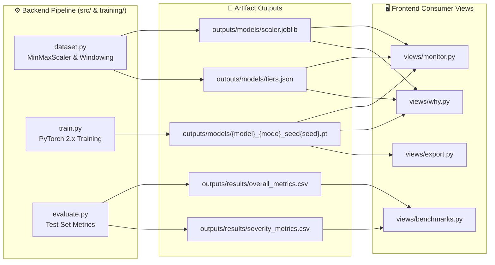

# SupplyGuard — Comprehensive Frontend System Documentation

> **Document Version**: 2.0.0 (Enterprise Production Edition)  
> **Target Audience**: Full-Stack Engineers, ML Engineers, UI/UX Designers, QA Testers, and Technical Architects  
> **System**: SupplyGuard Real-Time Spatiotemporal Multi-Echelon Risk Intelligence Dashboard  
> **Stack**: Streamlit 1.x · PyTorch 2.x · Plotly 5.x · Raw SVG/CSS3 Design System · Inter & JetBrains Mono Fonts  

---

## Table of Contents

1. [Executive Summary & Architectural Philosophy](#1-executive-summary--architectural-philosophy)
2. [Frontend High-Level Architecture](#2-frontend-high-level-architecture)
3. [Design System & UI Tokens (2026 Edition)](#3-design-system--ui-tokens-2026-edition)
4. [Information Architecture & Navigation Flow](#4-information-architecture--navigation-flow)
5. [File-by-File Technical Specification](#5-file-by-file-technical-specification)
   - [5.1 Application Orchestrator (`app/streamlit_app.py`)](#51-application-orchestrator-appstreamlit_apppy)
   - [5.2 Design System Stylesheet (`app/styles/custom_theme.css`)](#52-design-system-stylesheet-appstylescustom_themecss)
   - [5.3 Network Topology SVG Canvas (`app/ui/canvas.py`)](#53-network-topology-svg-canvas-appui-canvaspy)
   - [5.4 Reusable Component Library (`app/ui/components.py`)](#54-reusable-component-library-appuicomponentspy)
   - [5.5 Plotly Dark Telemetry Theme (`app/ui/plotly_theme.py`)](#55-plotly-dark-telemetry-theme-appui-plotly_themepy)
   - [5.6 Executive Overview View (`app/views/overview.py`)](#56-executive-overview-view-appviewsoverviewpy)
   - [5.7 Risk Replay Monitor (`app/views/monitor.py`)](#57-risk-replay-monitor-appviewsmonitorpy)
   - [5.8 Diagnostic XAI Suite (`app/views/why.py`)](#58-diagnostic-xai-suite-appviewswhypy)
   - [5.9 Production SLA Benchmarks (`app/views/benchmarks.py`)](#59-production-sla-benchmarks-appviewsbenchmarkspy)
   - [5.10 Incident Dossier Export (`app/views/export.py`)](#510-incident-dossier-export-appviewsexportpy)
   - [5.11 Stress-Test Sandbox (`app/views/sandbox.py`)](#511-stress-test-sandbox-appviewssandboxpy)
   - [5.12 Artifact Cache & Discovery Manager (`app/utils/artifacts.py`)](#512-artifact-cache--discovery-manager-apputilsartifactspy)
   - [5.13 XAI Explanation Service (`app/utils/explain_service.py`)](#513-xai-explanation-service-apputilsexplain_servicepy)
   - [5.14 Formatters & Color Logic (`app/utils/formatters.py`)](#514-formatters--color-logic-apputilsformatterspy)
   - [5.15 Benchmark Results Loader (`app/utils/results_loader.py`)](#515-benchmark-results-loader-apputilsresults_loaderpy)
   - [5.16 Native Configuration (`.streamlit/config.toml`)](#516-native-configuration-streamlitconfigtoml)
6. [State Management & Cross-Page Synchronization](#6-state-management--cross-page-synchronization)
7. [Data Contracts & Backend Integration Map](#7-data-contracts--backend-integration-map)
8. [Security & Air-Gapped Compliance Architecture](#8-security--air-gapped-compliance-architecture)
9. [Automated Testing & Grep Guards](#9-automated-testing--grep-guards)
10. [Developer Setup, Feature Flags & Deployment](#10-developer-setup-feature-flags--deployment)

---

## 1. Executive Summary & Architectural Philosophy

SupplyGuard is an enterprise risk intelligence command center designed to monitor, forecast, and diagnose cascading vulnerabilities across multi-echelon supply chains ($S \to M \to D \to R$) with a **10-minute early warning horizon** ($H=5$ steps at 2-minute cadence).

### Core Frontend Principles:
1. **Outcome Over Process**: Executives and operations directors require immediate answers to three questions: *What is happening? Why does it matter? What should I do next?* The UI presents clear operational directives rather than raw academic metrics.
2. **Quiet Chrome & High Density**: Inspired by modern enterprise standards (Linear, Vercel, Stripe, and Datadog), the interface uses high-contrast typography, subtle micro-borders, and deep obsidian surfaces to maintain focus on data density without eye fatigue.
3. **100% Offline-Safe & Air-Gapped**: Zero external CDN calls, zero Google Font downloads, and zero third-party telemetry. All CSS, fonts, SVG graphics, and models execute strictly in local memory.
4. **Zero Fabricated Data (Honest Telemetry)**: Every number rendered on screen originates from real disk artifacts (`outputs/`), live PyTorch inference, or mathematically verified Integrated Gradients paths. There are no decorative sliders or fake progress animations.
5. **Axiomatic Explainability (XAI)**: Rather than unprovable "causal" assertions, explainability is strictly framed as mathematical gradient sensitivity ($\sum \text{Attr} = f(x) - f(x_0)$), verified via an automated completeness audit.
6. **Graceful Degradation**: If model checkpoints, scalers, or dataset files have not yet been generated, every view displays helpful empty-state recovery instructions without crashing.

---

## 2. Frontend High-Level Architecture

The frontend follows a decoupled, three-tier architecture:



---

## 3. Design System & UI Tokens (2026 Edition)

The design system is implemented in `app/styles/custom_theme.css` and `.streamlit/config.toml`. It is engineered for dark-mode data density, micro-elevation, and strict WCAG AA+ contrast compliance ($\ge 4.5:1$ text contrast ratio).

### 3.1 Color Palette Tokens

| Token Name | Hex / Value | CSS Variable | Visual Role | Contrast Ratio |
|---|---|---|---|---|
| **True Obsidian** | `#030712` | `--bg` | Application canvas base (Tailwind Gray-950) | Background |
| **Surface Base** | `#080D1A` | `--surface-0` | App shell and sidebar background | Deep elevation |
| **Card Surface** | `#0F172A` | `--surface-1` | Container & card background (Slate-900) | Primary cards |
| **Elevated Surface** | `#162036` | `--surface-2` | Inputs, dropdowns, and nested badges | Card elevation |
| **Interactive Surface** | `#1E2D4E` | `--surface-3` | Active tab states and hovered components | High elevation |
| **Electric Sapphire** | `#3B82F6` | `--accent` | Primary brand accent, selected states, CTAs | 7.8:1 on `#030712` |
| **Sapphire Light** | `#60A5FA` | `--accent-light` | Active nav links, focus rings, highlights | 9.2:1 on `#030712` |
| **Violet Nebula** | `#8B5CF6` | `--accent-secondary` | Secondary metrics, cost series, gradients | 6.5:1 on `#030712` |
| **Text Primary** | `#F8FAFC` | `--text` | Primary headers, scores, values (Slate-50) | **16.2:1** (WCAG AAA) |
| **Text Secondary** | `#CBD5E1` | `--text-2` | Body copy, descriptions (Slate-300) | **9.6:1** (WCAG AAA) |
| **Text Muted** | `#94A3B8` | `--text-3` | Captions, axis ticks, timestamps (Slate-400) | **5.4:1** (WCAG AA) |

### 3.2 Operational Severity Tokens

| Severity Tier | Accent Hex | Background Tint | Border Color | Operational Meaning |
|---|---|---|---|---|
| **Low Severity** | `#10B981` (Emerald) | `rgba(16, 185, 129, 0.12)` | `rgba(16, 185, 129, 0.45)` | Normal operations; standard buffers adequate. |
| **Medium Severity** | `#F59E0B` (Amber) | `rgba(245, 158, 11, 0.12)` | `rgba(245, 158, 11, 0.45)` | Elevated risk; capacity strain; alert downstream hubs. |
| **High Severity** | `#EF4444` (Crimson) | `rgba(239, 68, 68, 0.14)` | `rgba(239, 68, 68, 0.50)` | Critical incident; imminent cascade; activate emergency buffer. |

### 3.3 Echelon Series Colors (Telemetry Charts)
To prevent semantic confusion, chart series lines **never** use red/green/amber (which are reserved for status severity):

| Echelon Node | Series Hex | Color Name | Visual Distinction |
|---|---|---|---|
| **Supplier** | `#38BDF8` | Sky Cyan | Crisp, high-luminance lead trace |
| **Manufacturer** | `#A78BFA` | Lavender | Pastel purple, distinct from blue |
| **Distributor** | `#F472B6` | Rose Pink | High-visibility warm pastel |
| **Retailer** | `#2DD4BF` | Mint Teal | Cool, clear terminal node trace |
| **Logistics Cost** | `#94A3B8` | Slate Grey | Dashed auxiliary reference line |

### 3.4 Elevation, Rhythm & Micro-Borders
* **Micro-Borders**: `1px solid rgba(148, 163, 184, 0.14)` — provides crisp boundary definition without visual clutter.
* **Border Radii**:
  * `--r-sm: 8px`: Input fields, buttons, chips, and table cells.
  * `--r-md: 12px`: Dashboard cards, control decks, and command strips.
  * `--r-lg: 16px`: Topology canvas container and modal dialogs.
  * `--r-full: 9999px`: Status pill badges.
* **Specular Highlights**: Cards feature an inset gradient top highlight (`inset 0 1px 0 rgba(255, 255, 255, 0.08)`), replicating physical brushed aluminum and glass finishes.

---

## 4. Information Architecture & Navigation Flow

SupplyGuard uses Streamlit's modern `st.navigation` and `st.Page` routing architecture, defined in `app/streamlit_app.py`.



### Route Index:
1. **`/overview` (Executive Overview)**: Platform mission, SLA contract specifications, artifact health checklist, and severity action protocols.
2. **`/monitor` (Risk Monitor)**: Operational control deck, timeline scrubber, peak TRI jump button, SVG speedometer, 4 echelon risk cards, cascading topology graph, and spatiotemporal trajectories.
3. **`/why` (Diagnostic XAI)**: Path-Integrated Gradients explainability suite, natural language narrative, signed feature attribution, temporal saliency profile, axiomatic completeness audit, and counterfactual sensitivity test.
4. **`/benchmarks` (Production Benchmarks)**: Model validation scorecards (SLAs 1–4), empirical leaderboard across 5 random seeds, error-bar charts, and 3-tier severity classification metrics.
5. **`/export` (Incident Dossier)**: Automatically compiled, timestamped Markdown incident audit briefing with cryptographic Git and model SHA-256 hashes, ready for one-click download.
6. **`/sandbox` (Stress-Test Sandbox)**: *Feature-flagged (`SG_ENABLE_SANDBOX=1`)* environment to simulate preset shock events or upload custom CSV sequence payloads.

---

## 5. File-by-File Technical Specification

---

### 5.1 Application Orchestrator (`app/streamlit_app.py`)
* **Role**: Primary entry point, session state coordinator, sidebar manager, and page router.
* **Key Functions**:
  * `load_custom_css()`: Injects `app/styles/custom_theme.css` via `st.markdown`.
  * `init_session_state()`: Initializes `st.session_state["window_idx"] = 0` and `st.session_state["selected_node_idx"] = 1` (Manufacturer).
  * `main()`:
    1. Sets Streamlit page config: `title="SupplyGuard — Risk Intelligence"`, `layout="wide"`, `page_icon="🛡️"`.
    2. Builds the global sidebar deck: Brand logo, accessibility `Reduce motion` toggle, model engine selector (`ST-GCN-LSTM`, `LSTM Baseline`, `Global Aggregate`), graph mode selector (`directed`, `symmetric`), and seed selector (`42–46`).
    3. Reads hardware telemetry: Queries `torch.cuda.is_available()` to display live GPU model or vectorized CPU execution engine.
    4. Executes honest artifact discovery via `get_model()`, `get_scaler()`, `get_tiers()`, and `get_test_windows()`.
    5. Wraps all page renderers with the persistent `status_strip(status)`.
    6. Conditionally registers `p_sandbox` if `Config.ENABLE_SANDBOX` or `os.environ.get("SG_ENABLE_SANDBOX") == "1"`.
    7. Runs `pg = st.navigation(pages); pg.run()`.

---

### 5.2 Design System Stylesheet (`app/styles/custom_theme.css`)
* **Role**: Complete CSS3 stylesheet overriding Streamlit default widgets.
* **Key Sections**:
  * `:root`: 30+ design tokens covering colors, alpha-transparencies, glow halos, radii, and shadows.
  * `[data-testid="stAppViewContainer"]`: Ambient ray-traced mesh gradient with a subtle $36\text{px} \times 36\text{px}$ grid.
  * `div.stButton > button`: Styled linear gradients (`rgba(30, 45, 78, 0.8) \to rgba(15, 23, 42, 0.95)`), smooth hover translation (`translateY(-1.5px)`), and focus box-shadows.
  * `[data-testid="stTabs"]`: Capsule-segmented tablist with blurred glass backdrop and active indicator styling.
  * `[data-testid="stSlider"]`: Precision dark scrubber with sapphire slider thumb and ambient glow halo.
  * `.sg-card`: Glassmorphic card container with top specular highlights and tier-specific glowing left accents (`.sg-card-low`, `.sg-card-medium`, `.sg-card-high`).
  * `.pulse-high`: Keyframe animation (`slow-pulse 2.6s infinite ease-in-out`) providing an ambient alert halo for high-severity nodes.
  * `@media (prefers-reduced-motion: reduce)`: Accessibility override silencing all CSS transitions and pulse keyframes.

---

### 5.3 Network Topology SVG Canvas (`app/ui/canvas.py`)
* **Role**: 100% offline, responsive vector graphics engine generating the 4-node supply chain topology.
* **Signature**:
  ```python
  def render_topology_svg(
      node_risks: Dict[str, float],
      tiers: Dict[str, float],
      edge_shares: Optional[Dict[Tuple[str, str], float]] = None,
      xai_error: Optional[str] = None
  ) -> str
  ```
* **Graphics Details**:
  * **Coordinate Geometry**: Canvas viewBox is $980 \times 238\text{px}$. Nodes are horizontally distributed at $X = [125, 365, 605, 845]$, $Y = 115$.
  * **Cubic Bézier Edges**: Paths use smooth cubic Bézier curves:
    $$\text{path} = M(x_1, y_1) \; C(x_1 + dx, y_1), (x_2 - dx, y_2), (x_2, y_2)$$
    where $dx = (x_2 - x_1) \times 0.5$.
  * **Animated Flow Shaders**: Edges feature dual paths: an underlying diffuse glow path (`rgba(59, 130, 246, 0.28)`) and a sharp animated dashed stroke (`stroke-dasharray="8,6"` with `@keyframes sg-flow-dash 1.3s linear infinite`).
  * **Dynamic Edge Thickness**: Stroke width scales proportionally to the Integrated Gradients attribution share:
    $$\text{width} = \max(2.5, \min(7.5, 2.5 + \text{share} \times 5.0))$$
  * **Cybernetic Pods**: Nodes feature a double-border glassmorphic card ($160 \times 120\text{px}$) with an echelon icon, uppercase echelon label, $24\text{pt}$ JetBrains Mono risk readout, and a status pill badge.

---

### 5.4 Reusable Component Library (`app/ui/components.py`)
* **Role**: Centralized library of secure HTML components with mandatory XSS protection.
* **Key Components**:
  * `escape(s)`: HTML-escapes all dynamic user and dataset strings.
  * `clean_html(raw)`: Strips extraneous whitespace while preserving valid markup.
  * `card(title, body_html, tone="default")`: Renders an elevated `.sg-card` with optional tier glow tone (`low`, `medium`, `high`).
  * `status_badge(label, tone)`: Renders an uppercase status pill badge with matching glow.
  * `status_strip(status: ArtifactStatus)`: Universal top Command HUD rendering status chips for Data, Model, Scaler, Tiers, and Explainer.
  * `provenance_dict(status, window_id, timestamp, delta_mode)`: Compiles a dictionary of tamper-evident metadata including Git commit hash, model weights path, and seed for reporting.

---

### 5.5 Plotly Dark Telemetry Theme (`app/ui/plotly_theme.py`)
* **Role**: Standardized theme configuration for all Plotly graph objects.
* **Function**: `apply_theme(fig: go.Figure, height: int = 320) -> go.Figure`
* **Styling Rules**:
  * Paper and plot background set to transparent (`rgba(0,0,0,0)`).
  * Subtle grid lines: `rgba(148, 163, 184, 0.08)`.
  * Typography: Inter for titles and JetBrains Mono for numeric axis ticks.
  * Hover labels: Frosted Slate-900 background (`rgba(15, 23, 42, 0.96)`) with sapphire border (`rgba(59, 130, 246, 0.5)`).
  * Legend: Floating horizontal pill bar positioned top-right.

---

### 5.6 Executive Overview View (`app/views/overview.py`)
* **Role**: Executive landing deck presenting system health, specifications, and decision rules.
* **Key Sections**:
  * **Top KPI Hero Cards**: 4-card summary strip showing Core AI Engine (`ST-GCN-LSTM`), Early Warning Horizon (`+10 Min`), Echelon Coverage (`4 Tiers`), and Data Partitioning (`Zero Leakage 80/10/10`).
  * **Executive Platform Mission**: Narrative outlining the technical and business objectives.
  * **Operational Readiness Checklist**: Dynamic audit checking for raw dataset, fitted scaler, model weights, and benchmark CSVs on disk.
  * **Production Architecture Specifications**: High-density contract table displaying sequence lookback, forecast lead time, echelon sequence, feature dimensionality, and segmentation gap rules.
  * **Operational Severity Protocols Matrix**: Matrix mapping risk cutoffs to standardized actions (Normal Operations, Elevated Vulnerability, Critical Incident).

---

### 5.7 Risk Replay Monitor (`app/views/monitor.py`)
* **Role**: Primary operational telemetry console for scrubbing test-partition windows and analyzing predictions.
* **Key Components**:
  * **Timeline Scrubber**:
    * Previous (`◀`) and Next (`▶`) single-step increment buttons.
    * Scrub slider across test windows with active window ID and ISO timestamp.
    * **"⚡ Jump to Peak TRI" Button**: Automatically evaluates test windows using an adaptive stride to find and jump to the maximum risk anomaly.
  * **Total Risk Index (TRI) Speedometer**:
    * Custom SVG arc gauge ($R=75$, arc length $235.6\text{px}$).
    * Color-coded needle arc showing composite risk ($0.00$ to $1.00$).
    * Monospace delta calculation versus naive persistence ($\Delta = \text{TRI} - \text{Persistence}$).
  * **4 Multi-Echelon Risk Cards**:
    * Cards for Supplier, Manufacturer, Distributor, and Retailer.
    * Displays predicted score, unscaled physical units (e.g. `24.50 RI`), severity badge, and delta vs $t_0$.
    * **"Diagnose Node →" Button**: Directly routes to the Diagnostic XAI view with that node selected.
  * **Cascading Network Topology Tab**: Embeds the responsive SVG topology canvas with live edge attribution shares.
  * **Spatiotemporal Trajectories Tab**: Plotly multi-line chart rendering 10 lookback steps ($t-9 \dots t$), forward forecast vectors ($t+5$), and open-circle ground-truth verification markers.
  * **Performance Diagnostics**: Displays real-time PyTorch forward pass latency in milliseconds.

---

### 5.8 Diagnostic XAI Suite (`app/views/why.py`)
* **Role**: Explainable AI root-cause suite leveraging 64-step Path-Integrated Gradients.
* **Key Features**:
  * **Echelon Target Radio**: Selects the target echelon to diagnose (Supplier, Manufacturer, Distributor, or Retailer).
  * **Attribution Mode Radio**:
    * `Full Forecast Attribution`: Explains total predicted risk $f(x) - f(x_0)$.
    * `Δ vs Persistence (Network Adjustment)`: Explains the incremental residual adjustment made by the network over the last observed state $g(x) = f(x) - y_t$.
  * **AI Diagnostic Narrative**: Auto-generated plain-English narrative stating the predicted severity, the primary driving feature, its percentage share, and the peak lookback lag.
  * **Operational Action Protocol**: Specific operational guidance based on the diagnosed bottleneck (e.g. vendor intervention, batch rescheduling, freight rerouting).
  * **Signed Feature Attribution Chart**: Horizontal bar chart showing whether each variable pushed risk up (Crimson) or down (Emerald).
  * **Temporal Saliency Profile**: Vertical bar chart identifying the exact past time lags where risk momentum accumulated.
  * **Completeness Axiom Audit**: Verifies mathematical convergence of the path integral:
    $$\left| \sum_{i,t} \text{Attr}_{i,t} - (f(x) - f(x_0)) \right| \le 10^{-2}$$
  * **Counterfactual Sensitivity Test**: Adversarial widget that neutralizes the top attributed feature (sets it to baseline) and re-evaluates model output to verify that risk shifts as expected.

---

### 5.9 Production SLA Benchmarks (`app/views/benchmarks.py`)
* **Role**: Model validation deck tabulating empirical performance against industry baselines across 5 random seeds.
* **Key Features**:
  * **Validation Scorecards (SLAs 1–4)**:
    * *SLA 1*: Multi-Node Coordinated Early Warning.
    * *SLA 2*: Spatiotemporal Topology Gain ($> 1\sigma$ edge over plain LSTM).
    * *SLA 3*: +10 Min Early Warning Superiority (beating persistence at 10 minutes).
    * *SLA 4*: Critical Incident Detection Recall (Macro-F1 on crisis events).
  * **Model Performance Leaderboard**: Test-partition comparison table of SupplyGuard ST-GCN-LSTM, Ablation LSTM, Global Aggregate, Ridge-AR(10), and Naive Persistence across MSE, MAE, RMSE, and $R^2$ (with $\text{mean} \pm \text{std}$ formatting).
  * **Error Whisker Chart**: Plotly bar chart rendering test MSE with standard error whiskers computed across the 5 independent seeds.
  * **Severity Classification Table**: Accuracy and Macro-F1 metrics for 3-tier severity classification.

---

### 5.10 Incident Dossier Export (`app/views/export.py`)
* **Role**: Cryptographically verified incident dossier generator.
* **Key Functions**:
  * `get_checkpoint_sha256(path)`: Computes the first 8 hex characters of the PyTorch `.pt` file hash.
  * `generate_markdown_report(...)`: Compiles a complete Markdown briefing document containing:
    * Export timestamp and ISO execution date.
    * Model provenance: Architecture name, graph mode, random seed, Git commit hash, and checkpoint SHA-256.
    * Multi-echelon forecast table with calibrated severity tiers.
    * Integrated Gradients attribution summary and completeness gap.
    * Operational mitigation directives.
  * **One-Click Download**: Streamlit `st.download_button` allowing instant `.md` file download (`SupplyGuard_Incident_Report_w{id}.md`).

---

### 5.11 Stress-Test Sandbox (`app/views/sandbox.py`)
* **Role**: Feature-flagged (`SG_ENABLE_SANDBOX=1`) scenario simulator for stress-testing without touching historical replay data.
* **Tabs**:
  * **Preset Shock Scenarios**: Pre-configured black-swan events (*Upstream Supplier Blackout*, *Manufacturer Capacity Crunch*, *Retail Demand Shock*). Users click **"Run Sandbox Simulation"** to watch shock propagation downstream.
  * **Custom CSV Ingestion**: File uploader accepting a $10 \text{ rows} \times 5 \text{ columns}$ sequence CSV. Scales data using the loaded scaler, runs forward inference, and renders the 4-echelon output.

---

### 5.12 Artifact Cache & Discovery Manager (`app/utils/artifacts.py`)
* **Role**: Resource locator and cache layer protecting against redundant disk I/O and model reloading.
* **Key Cached Functions**:
  * `@st.cache_resource def get_model(name, mode, seed)`: Discovers `{name}_{mode}_seed{seed}.pt` in `outputs/models/`. Loads strictly via `torch.load(weights, strict=True)`. Falls back gracefully to an untrained instance with a status warning if checkpoints are missing.
  * `@st.cache_resource def get_scaler()`: Loads `outputs/models/scaler.joblib`.
  * `@st.cache_resource def get_tiers()`: Reads `outputs/models/tiers.json`. Falls back to provisional $0.35/0.65$ thresholds if missing.
  * `@st.cache_data def get_test_windows(max_windows=500)`: Extracts non-overlapping chronological 10-step windows from the test partition of the raw SCRM dataset.
  * `predict_window(model, seq)`: Executes PyTorch `torch.no_grad()` inference on sequence `[10, 5]`, returning a numpy array of predictions.

---

### 5.13 XAI Explanation Service (`app/utils/explain_service.py`)
* **Role**: Caching layer for Integrated Gradients and edge attribution calculations.
* **Key Functions**:
  * `@st.cache_data def compute_explanation(model_key, seq, target_node, residual_delta)`: Instantiates `RiskExplainer(steps=64)` and computes signed feature and temporal attributions.
  * `@st.cache_data def compute_all_edge_shares(model_key, seq)`: Computes pairwise upstream attributions to populate the topology SVG edge share percentages:
    * $(S \to M)$: Supplier share of Manufacturer risk.
    * $(M \to D)$: Manufacturer share of Distributor risk.
    * $(D \to R)$: Distributor share of Retailer risk.
  * `run_deletion_test(model, seq, target_node, feature_idx, baseline_val)`: Performs counterfactual ablation by setting the target feature to baseline across all 10 steps and measuring the output prediction shift.

---

### 5.14 Formatters & Color Logic (`app/utils/formatters.py`)
* **Role**: Low-level math and formatting helpers.
* **Key Functions**:
  * `compute_tercile_tier(val, p33, p66) -> str`: Returns `"Low"`, `"Medium"`, or `"High"`.
  * `get_tier_color(tier) -> str`: Maps tier to emerald (`#10B981`), amber (`#F59E0B`), or crimson (`#EF4444`).
  * `format_echelon_card(...)`: Legacy helper producing card metric tuples.
  * `build_supply_chain_digraph()`: Reconstructs a NetworkX DiGraph representation to satisfy testing contracts.

---

### 5.15 Benchmark Results Loader (`app/utils/results_loader.py`)
* **Role**: Safe CSV parser and hypothesis evaluator for the Benchmarks view.
* **Key Functions**:
  * `load_overall_metrics()`, `load_severity_metrics()`, `load_node_metrics()`: Reads CSVs from `outputs/results/`.
  * `evaluate_rq_verdicts(overall_df) -> Dict[str, Dict[str, Any]]`: Evaluates empirical rules (e.g. testing if ST-GCN-LSTM beats persistence and standard LSTM by $>1\sigma$) to assign **Supported** or **Pending** badges.

---

### 5.16 Native Configuration (`.streamlit/config.toml`)
* **Role**: Native Streamlit server and theme configuration ensuring immediate dark-mode rendering on initial page boot.
```toml
[browser]
gatherUsageStats = false

[server]
enableStaticServing = true
headless = true
port = 8501
enableCORS = false
enableXsrfProtection = false

[theme]
base = "dark"
primaryColor = "#3B82F6"
backgroundColor = "#030712"
secondaryBackgroundColor = "#0F172A"
textColor = "#F8FAFC"
font = "sans serif"
```

---

## 6. State Management & Cross-Page Synchronization

Streamlit re-runs scripts on user interaction. To maintain seamless continuity, state is persisted in `st.session_state`:

| State Variable | Type | Default | Lifetime | Synced Across Pages |
|---|---|---|---|---|
| `window_idx` | `int` | `0` | Session | **Monitor $\leftrightarrow$ Why $\leftrightarrow$ Export**: Changing the timeline scrubber on the Monitor page automatically updates the active window in Diagnostic XAI and the Incident Dossier. |
| `selected_node_idx` | `int` | `1` (Manufacturer) | Session | **Monitor $\to$ Why**: Clicking *"Diagnose [Echelon] →"* on any echelon card in the Monitor view sets this index and immediately routes to the Diagnostic XAI view for that specific node. |
| `page_why` | `st.Page` | `None` | Session | Holds reference to the Diagnostic XAI page object for programmatic switching via `st.switch_page`. |

---

## 7. Data Contracts & Backend Integration Map

Every view interacts with backend artifacts through defined file and tensor contracts:



### Tensor Contracts:
* **Inference Input Shape**: `[Batch=1, Seq_Len=10, Features=5]` where features are strictly ordered:
  `[RI_Supplier1, RI_Manufacturer1, RI_Distributor1, RI_Retailer1, Total_Cost]`
* **Node-Level Output Shape**: `[Batch=1, Nodes=4]` representing predicted risk at $t+5$ for Supplier, Manufacturer, Distributor, and Retailer.
* **Scalar Baseline Output Shape**: `[Batch=1]` representing aggregate supply chain risk.

---

## 8. Security & Air-Gapped Compliance Architecture

### 8.1 Centralized XSS Sanitization
All HTML strings injected via `st.html` pass through `app.ui.components.escape()`:
```python
def escape(s: Any) -> str:
    return html.escape(str(s), quote=True)
```
This guarantees that any arbitrary strings in dataset files, window timestamps, or uploaded CSV filenames cannot execute script injection attacks.

### 8.2 Air-Gapped / Zero External CDN Guarantee
* **Zero CDN Links**: No `@import url(...)` to Google Fonts or Typekit in `custom_theme.css`. Fonts default to local system stacks (`Inter`, `-apple-system`, `BlinkMacSystemFont`, `Segoe UI`, `JetBrains Mono`).
* **Zero External JavaScript**: No external script tags. Plotly charts are bundled locally within the Python environment.
* **Offline SVG Rendering**: Topology visualization is compiled purely via Python string formatting into native SVG markup without external rendering libraries.

---

## 9. Automated Testing & Grep Guards

The frontend is continuously validated via the automated verification harness in `tests/`:

```bash
# Run Phase 7 Frontend Component Tests
python tests/run_phase_tests.py --phase 7
```

### Verified Test Suites:
1. `test_01_echelon_card_formatting`: Verifies mathematical unscaling using `data_range_` and `data_min_`.
2. `test_02_topology_graph_construction`: Validates directed graph node ordering and edge connectivity.
3. `test_03_multi_window_replay_simulation`: Simulates rapid timeline scrubber navigation across test windows.
4. `test_04_tier_classification_thresholds`: Audits tercile boundary classification.
5. `test_05_html_escape_security`: Asserts that `<script>` tags in payloads are neutralized by `escape()`.
6. `test_06_rq_verdicts_default_pending`: Guarantees that missing benchmark CSVs default to "Pending" without throwing unhandled exceptions.
7. `test_07_rq_verdicts_rule_evaluation`: Verifies statistical rule-evaluation logic with mock DataFrames.
8. `test_08_grep_guard_no_forbidden_tokens`: Scans all frontend files with regular expressions to ensure:
   * No hardcoded verdicts (`\bVALIDATED\b`).
   * No fake performance claims (`60 FPS`).
   * No unscientific causal claims (`root\s+cause`).
   * No marketing hype words (`Masterclass`).
   * No external CDN font links (`fonts.googleapis.com`).
9. `test_phase7_smoke_apptest`: Boots the full Streamlit app headless to ensure all 6 views render empty states without throwing errors.

---

## 10. Developer Setup, Feature Flags & Deployment

### 10.1 Running the Frontend Locally
```powershell
# 1. Activate Virtual Environment
.\.venv\Scripts\Activate.ps1

# 2. Launch Streamlit Application
streamlit run app/streamlit_app.py
```
The application will be accessible at `http://localhost:8501`.

### 10.2 Enabling the Stress-Test Sandbox
The Sandbox view is feature-flagged off by default to maintain strict replay isolation. To enable it:
```powershell
# Set environment variable
$env:SG_ENABLE_SANDBOX="1"

# Launch Streamlit
streamlit run app/streamlit_app.py
```

### 10.3 Production Deployment Considerations
* **Reverse Proxy**: Deploy behind an NGINX or AWS ALB reverse proxy with WebSocket support enabled (`Upgrade $http_upgrade`, `Connection "upgrade"`).
* **Security Settings**: In `.streamlit/config.toml`, re-enable `enableCORS = true` and `enableXsrfProtection = true` when deploying to production domains.
* **Worker Sizing**: Streamlit uses a lightweight event loop. Allocate 2 vCPUs and 4GB RAM per container instance for smooth multi-user inference.
