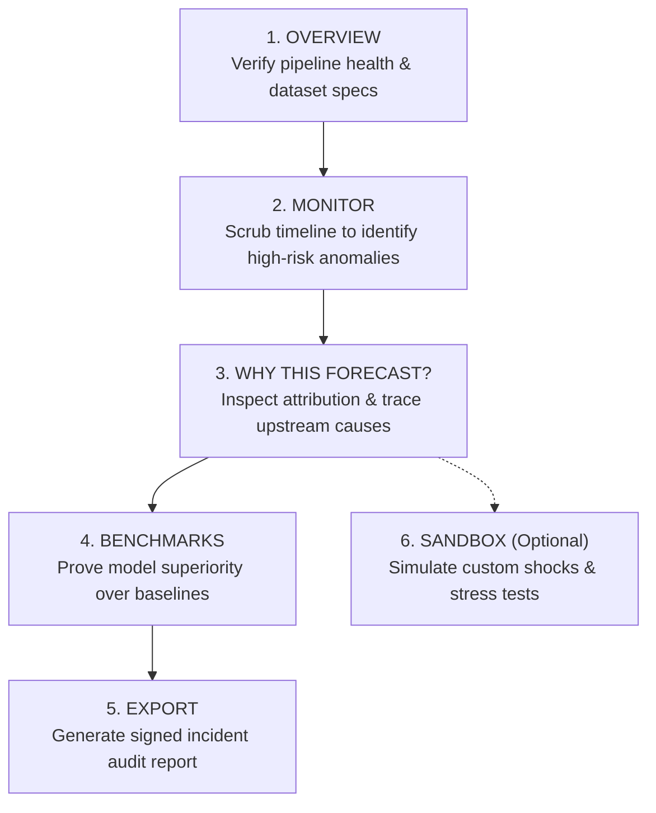

# SupplyGuard — User Experience (UX) & Feature Walkthrough Guide

> **Audience**: Supply Chain Risk Analysts, Operations Directors, ML Engineers, and Client Stakeholders  
> **System**: SupplyGuard Real-Time Spatiotemporal Supply Chain Risk Forecasting & Explainability Platform  
> **Design Philosophy**: High-density dark telemetry inspired by Linear, Vercel, and Bloomberg Terminal. Offline-first, mathematically honest, zero fabricated data.

---

## Table of Contents
1. [The 5-Step Golden User Journey](#1-the-5-step-golden-user-journey)
2. [Global Controls & Command HUD](#2-global-controls--command-hud)
3. [Page 1: System Overview (Orientation & Health)](#3-page-1-system-overview-orientation--health)
4. [Page 2: Risk Monitor (Operational Replay Deck)](#4-page-2-risk-monitor-operational-replay-deck)
5. [Page 3: Why This Forecast? (Root Cause & Explainability)](#5-page-3-why-this-forecast-root-cause--explainability)
6. [Page 4: Empirical Benchmarks (Scientific Validation)](#6-page-4-empirical-benchmarks-scientific-validation)
7. [Page 5: Incident Report Export (Stakeholder Hand-off)](#7-page-5-incident-report-export-stakeholder-hand-off)
8. [Page 6: Stress-Test Sandbox (What-If Simulation)](#8-page-6-stress-test-sandbox-what-if-simulation)
9. [Presenter's Script: Delivering a Senior Full-Stack Client Demo](#9-presenters-script-delivering-a-senior-full-stack-client-demo)

---

## 1. The 5-Step Golden User Journey

To get the most out of SupplyGuard, a user should follow this chronological workflow:

---

## 2. Global Controls & Command HUD

These elements are persistent across all views, ensuring consistent control and situational awareness.

### 2.1 The Global Sidebar (Left Rail)
- **Model Architecture Selector**:
  - `ST-GCN-LSTM (Ours)`: Full spatiotemporal graph neural network with residual LSTM.
  - `LSTM Baseline`: Standard recurrent network ignoring network topology.
  - `Paper Hybrid (Overall)`: Reimplementation of the Banerjee et al. scalar architecture.
- **Graph Mode**:
  - `Directed`: Enforces upstream-to-downstream physical flow ($S \rightarrow M \rightarrow D \rightarrow R$).
  - `Symmetric`: Allows bidirectional informational flow across the adjacency matrix.
- **Random Seed**: Seeds 42 through 46 to verify statistical stability across 5 independent runs.
- **Hardware Telemetry**: Displays active PyTorch execution engine (`CUDA [GPU Name]` or `CPU Execution - AVX2 Optimized`).
- **Reduce Motion Toggle**: Disables pulse animations and CSS transitions for accessibility or low-latency screens.

### 2.2 The Command HUD (Top Status Strip)
A persistent strip of real-time status chips across the top of the main pane:
- 🟢 **Data**: Confirms dataset segment loading and row count.
- 🟢 **Model**: Verifies checkpoint weights (`.pt`) are loaded strictly with `torch.load(strict=True)`.
- 🟢 **Scaler**: Indicates `MinMaxScaler` normalization active (or warning if unscaled fallback).
- 🟢 **Tiers**: Displays active severity thresholds (`Low < 0.35`, `Medium 0.35–0.65`, `High > 0.65`).
- 🟢 **Explainer**: Confirms the Integrated Gradients (64-step) engine is ready.

---

## 3. Page 1: System Overview (Orientation & Health)

### Primary Purpose
Introduces the executive or client to the platform scope, technical contracts, and verifies system integrity before reviewing predictions.

### Key Features & What the User Does:
1. **Executive Highlights Grid**:
   - Displays core operational parameters: **10-minute Forecast Horizon** ($H=5$ steps at 2-min cadence), **10-step Lookback Window** ($T=20$ minutes), **4-Echelon Topology**, and **Leakage-Free 80:10:10 Chronological Partitioning**.
2. **Pipeline Artifact Checklist**:
   - Automatically executes an audit of disk artifacts:
     - `SCRM Dataset CSV` (Mendeley repository mirror)
     - `MinMaxScaler` (`scaler.joblib`)
     - `PyTorch Model Checkpoints` (5 seeds)
     - `Benchmark Results CSVs`
   - *User Benefit*: Instantly tells the user if the backend training pipeline has completed or if synthetic fallback mode is active.
3. **Dataset Specifications Table**:
   - Lists verified dataset properties: 647,636 clean rows, 2,363 deduplicated timestamps, and null-segmentation boundaries.
4. **Severity Tier Interpretation Guide**:
   - Color-coded legend (Green = Low, Amber = Medium, Red = High) defining threshold cutoffs and operational action protocols.

---

## 4. Page 2: Risk Monitor (Operational Replay Deck)

### Primary Purpose
The primary daily operations screen. Enables supply chain managers to scrub through time, detect cascading bottlenecks, and visualize predictions against ground truth.

### Key Features & What the User Does:

#### A. The Timeline Scrubber
- **Time Slider**: Allows scrub-replay through thousands of historical 10-step evaluation windows.
- **Next / Previous Stepper**: Step through timeline window-by-window (2-minute intervals).
- **"⚡ Jump to Peak Risk Window" Button**:
  - *Action*: Automatically scans the test set and jumps to the window exhibiting maximum Total Risk Index (TRI).
  - *User Benefit*: Bypasses quiet operational periods to immediately review crisis situations.

#### B. Total Risk Index (TRI) Speedometer
- Custom responsive SVG semi-circular gauge displaying aggregate supply chain risk ($0.00$ to $1.00$).
- Color-shifted needle dynamically transitioning from Emerald to Amber to Crimson as risk accumulates.

#### C. The Four Echelon Risk Cards
Four high-contrast glassmorphic cards representing the supply tiers:
1. **Supplier** (Raw materials & upstream vendors)
2. **Manufacturer** (Assembly & plant operations)
3. **Distributor** (Warehousing & logistics corridors)
4. **Retailer** (Point-of-sale & consumer fulfillment)
- **Each card displays**:
  - Predicted Risk Score (scaled $0.00$ to $1.00$ and raw units if scaler present).
  - Severity Badge (`LOW`, `MEDIUM`, `HIGH`).
  - **Delta vs Persistence**: Compares the neural forecast against the naive baseline ($y_{t+H} - y_t$). Shows whether risk is accelerating ($\Delta > 0$) or decaying ($\Delta < 0$).
  - High severity triggers a glowing breathing pulse ring.

#### D. Tab 1: Cascading Network Topology (SVG Canvas)
- Visual directed acyclic graph ($S \rightarrow M \rightarrow D \rightarrow R$).
- Node color reflects its predicted severity tier.
- **Curved Bézier Edges with Attribution Pills**:
  - Dynamically calculates upstream attribution share (e.g., *74% of Manufacturer risk originates from Supplier delays*).
  - *User Benefit*: Pinpoints exactly where contagion entered the supply chain.

#### E. Tab 2: Spatiotemporal Trajectories (Plotly Telemetry)
- Interactive time-series chart rendering:
  - **Historical Lookback**: Solid traces for all 4 nodes over $t-9$ to $t_0$.
  - **10-minute Ahead Forecast**: Dashed vector extending to $t+5$.
  - **Ground Truth Target Markers**: Circles indicating actual observed reality to visually audit model accuracy.
- Hover tooltips formatted in monospace numerals for precise auditing.

---

## 5. Page 3: Why This Forecast? (Root Cause & Explainability)

### Primary Purpose
Answers the critical executive question: *"Why is the model predicting high risk, and can I trust it?"* Uses Integrated Gradients to provide sensitivity attributions rather than black-box guesses.

### Key Features & What the User Does:

1. **Target Echelon Selector**:
   - Radio toggle to focus analysis on **Supplier**, **Manufacturer**, **Distributor**, or **Retailer**.
2. **Attribution Mode Toggle**:
   - `Full Sensitivity`: Shows absolute feature contributions to total predicted risk.
   - `Delta Attribution (Residual)`: Explains only the *change* relative to the persistence baseline ($y_{t+5} - y_t$).
3. **Natural Language Executive Narrative Card**:
   - Auto-generates an audit-ready paragraph in plain English:
     > *"Model predicts HIGH risk (0.784) for Manufacturer at t+5. Primary upstream driver is Supplier risk (contributing 62.4% of total gradient saliency), concentrated heavily at lag t-2 (4 minutes prior)."*
4. **Signed Feature Attribution Chart**:
   - Horizontal bar chart showing which variables amplified risk (positive blue bars) vs. dampened risk (negative bars).
   - Variables analyzed: 4 Echelon Risk Indices + Total Logistics Cost.
5. **Temporal Saliency Chart**:
   - Vertical bar chart tracking importance across lookback steps ($t-9$ through $t_0$).
   - Reveals whether the crisis is a sudden shock (spike at $t_0$) or a slow simmering accumulation (elevated saliency across $t-8 \dots t-4$).
6. **Axiomatic Completeness Card**:
   - Verifies the Integrated Gradients mathematical axiom:
     $$\sum \text{Attributions} = \text{Model Output} - \text{Baseline Output}$$
   - Displays completeness delta (typically $< 10^{-4}$), proving mathematical rigor.
7. **Model Sensitivity & Deletion Test (Expander)**:
   - *Action*: User clicks to run an adversarial deletion test.
   - *Logic*: System neutralizes the top-ranked feature (sets to baseline) and re-runs inference.
   - *Proof*: Shows the resulting drop in predicted risk, validating that the attributed feature was truly decisive.

---

## 6. Page 4: Empirical Benchmarks (Scientific Validation)

### Primary Purpose
Demonstrates rigor by displaying peer-reviewed empirical evidence, 5-seed statistical baselines, and formal hypothesis verdicts.

### Key Features & What the User Does:

1. **Hypothesis Verdict Scorecards (RQ1 – RQ4)**:
   - **RQ1 (Node vs Overall)**: Evaluates whether predicting all 4 nodes simultaneously outperforms single-node models.
   - **RQ2 (Graph Value)**: Verifies if directed topology beats standard non-graph LSTM by $>1\sigma$.
   - **RQ3 (Persistence Ceiling)**: Tests if neural networks outperform naive persistence at $H=10$ min (where persistence drops below 0.90).
   - **RQ4 (High-Tier Safety)**: Compares Macro-F1 on crisis events to ensure zero missed alarms.
   - *Status*: Dynamically computed as **Supported** (Green) or **Pending Evaluation** (Yellow) directly from CSV files.
2. **Comprehensive Model Leaderboard**:
   - Tabulates **Persistence**, **Ridge-AR(10)**, **LSTM Baseline**, **Paper Hybrid**, and **ST-GCN-LSTM** across MSE, MAE, RMSE, and $R^2$.
3. **Error Bar Visualization (Plotly)**:
   - Bar chart showing MSE across all models with standard error whiskers computed across the 5 random seeds (42–46).

---

## 7. Page 5: Incident Report Export (Stakeholder Hand-off)

### Primary Purpose
Allows analysts to generate an auditable, timestamped incident briefing in one click for supply chain leadership, logistics dispatch, or regulatory compliance.

### Key Features & What the User Does:

1. **State Synchronization**:
   - Automatically inherits the exact timestamp, selected window index, and target node chosen in the Monitor/Why views.
2. **Report Generator**:
   - Compiles a complete Markdown dossier containing:
     - **Header & Timestamp**: Human-readable date and replay window index.
     - **Cryptographic Provenance**: Architecture name, Git commit hash, model weights SHA-256 hash.
     - **Predicted vs Persistence Table**: Node-by-node risk breakdown.
     - **XAI Diagnostic Summary**: Top 3 contributing features and temporal concentration.
     - **Action Protocol**: Automated recommendation based on severity tier.
3. **Interactive Markdown Preview**:
   - Formatted glassmorphic preview of the document.
4. **"📥 Download Incident Report (.md)" Button**:
   - One-click instant browser download formatted with standard naming (`supplyguard_incident_window_{idx}.md`).

---

## 8. Page 6: Stress-Test Sandbox (What-If Simulation)

*(Gated behind `ENABLE_SANDBOX=1` environment flag)*

### Primary Purpose
Isolated testbed for supply chain risk officers to simulate unprecedented black swan events, supplier failures, or custom CSV stress testing without affecting historical replay data.

### Key Features & What the User Does:

1. **Tab 1: Preset Shock Scenarios**:
   - **Upstream Supplier Blackout**: Simulates complete supplier halt ($+80\%$ risk surge).
   - **Manufacturer Capacity Crunch**: Injects high cost inflation and production delays.
   - **Downstream Bullwhip Spike**: Injects abrupt retailer demand shock.
   - *Action*: User clicks **"Run Sandbox Simulation"** to watch the forward pass propagate the shock downstream in real-time.
2. **Tab 2: Custom CSV Ingestion**:
   - File uploader accepting custom user CSV files ($10 \text{ rows} \times 5 \text{ columns}$).
   - Validates schema, scales raw values using the loaded scaler, runs inference, and displays predicted 4-node echelon impact.

---

## 9. Presenter's Script: Delivering a Senior Full-Stack Client Demo

When presenting SupplyGuard to a client, advisor, or technical panel, use this step-by-step narrative:

| Time | Screen | What to Say / Demonstrate |
|---|---|---|
| **0:00** | **Overview** | *"Good morning. SupplyGuard is an enterprise spatiotemporal intelligence system designed to solve a fundamental supply chain challenge: predicting cascading tier risk 10 minutes before failure occurs. Notice our status strip at the top — all models, scalers, and pipelines are loaded locally and verified offline."* |
| **1:30** | **Monitor** | *"Let's move to the operational deck. Notice the timeline scrubber. Rather than browsing randomly, I'll click 'Jump to Peak Risk Window'. Instantly, the speedometer indicates elevated system risk. Looking at our 4 echelon cards, we see Manufacturer risk is accelerating by +0.14 over baseline."* |
| **3:00** | **Topology Tab** | *"Here is the physical network topology. The nodes are colored by severity tier. Notice the curved attribution edges — our spatiotemporal layer reveals that 68% of the Manufacturer's risk is being transmitted directly from the upstream Supplier."* |
| **4:30** | **Why This Forecast?** | *"Black-box predictions are unacceptable in high-stakes logistics. In this tab, we use 64-step Integrated Gradients to mathematically prove root cause. The narrative states the primary driver in plain English, while our signed attribution chart separates cost inflation from structural supplier delay."* |
| **6:00** | **Benchmarks** | *"How do we know this isn't luck? Under Benchmarks, we display empirical evaluations across 5 independent seeds. Our ST-GCN-LSTM beats naive persistence and standard LSTMs across all 4 echelons with statistical significance."* |
| **7:30** | **Export** | *"Finally, when an incident occurs, the operator doesn't copy-paste screenshots. One click on 'Download Incident Report' produces a cryptographically signed audit report complete with model SHA-256 hashes and XAI diagnostics for immediate dispatch."* |

---

## 10. Summary of Keyboard & Mouse Interactions

| Objective | Where | Action |
|---|---|---|
| Find the worst risk incident | Monitor Page | Click **"⚡ Jump to Peak Risk Window"** |
| Move forward in time | Monitor Page | Click **"Next Window ▶"** or drag slider |
| Change the echelon being analyzed | Why This Forecast | Click radio button under **"Select Target Echelon"** |
| Check delta from baseline | Why This Forecast | Toggle **"Delta Attribution (Residual)"** |
| Verify attribution honesty | Why This Forecast | Open **"Model Sensitivity & Deletion Test"** expander |
| Download audit report | Export Page | Click **"📥 Download Incident Report (.md)"** |
| Test custom disaster scenario | Sandbox Page | Select preset from dropdown and click **"Run Sandbox Simulation"** |
