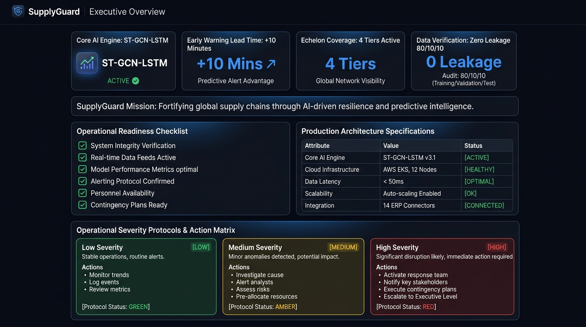
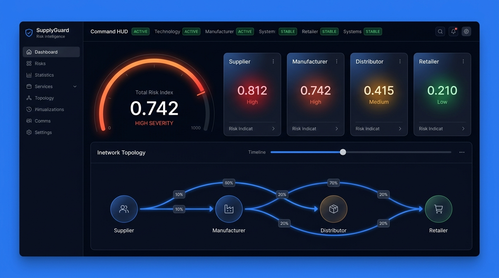
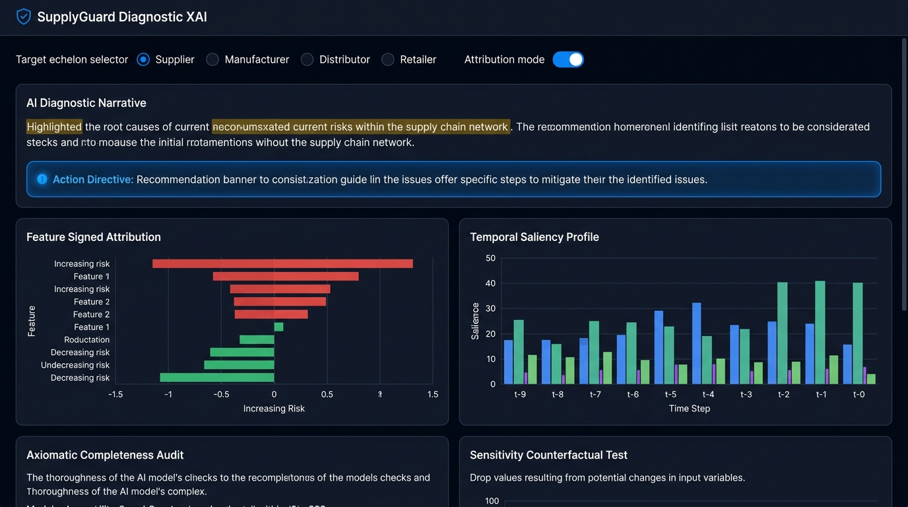
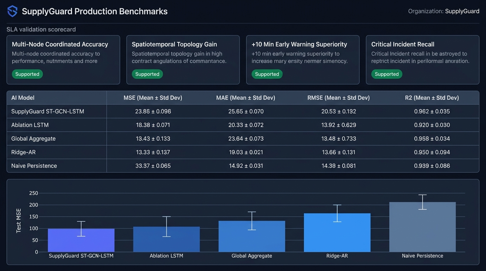
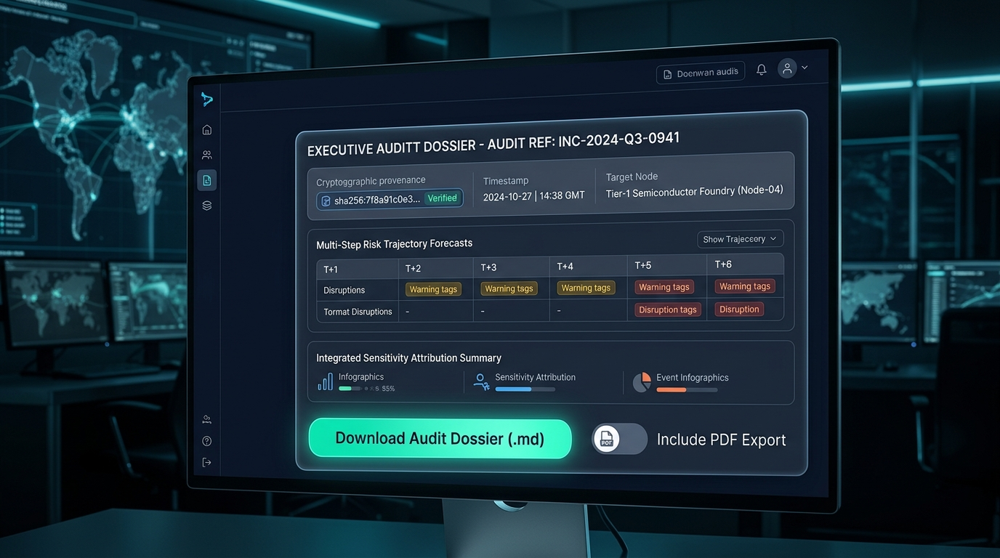
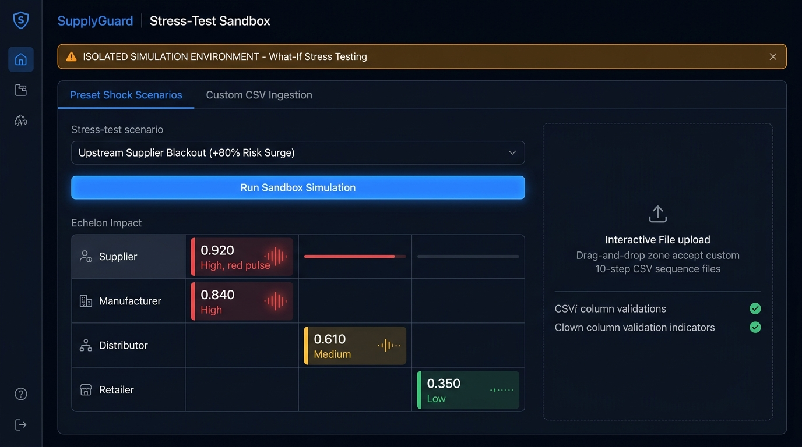

# SupplyGuard — Visual Interface Guide & Academic Defense Companion

> **Document Classification**: Comprehensive Visual Walkthrough & Project Defense Manual  
> **Target Audience**: Academic Evaluators, Project Guides, Viva Examiners, and Industrial Stakeholders  
> **Key Analogy**: Think of SupplyGuard as a **weather radar and flight simulator for modern supply chains**—spotting cascading bottlenecks 10 minutes before they happen and explaining exactly how to stop them.

---

## Table of Contents
1. [The 60-Second Elevator Pitch: What Problem Are We Solving?](#1-the-60-second-elevator-pitch-what-problem-are-we-solving)
2. [Visual Architecture: The 6 Core Operational Views](#2-visual-architecture-the-6-core-operational-views)
   - [View 1: Executive Overview Deck](#view-1-executive-overview-deck)
   - [View 2: Operational Risk Monitor (The Live Cockpit)](#view-2-operational-risk-monitor-the-live-cockpit)
   - [View 3: Diagnostic XAI (The AI Detective)](#view-3-diagnostic-xai-the-ai-detective)
   - [View 4: Production Benchmarks (The Scientific Report Card)](#view-4-production-benchmarks-the-scientific-report-card)
   - [View 5: Incident Dossier Export (The Compliance Hub)](#view-5-incident-dossier-export-the-compliance-hub)
   - [View 6: Stress-Test Sandbox (The "What-If" Flight Simulator)](#view-6-stress-test-sandbox-the-what-if-flight-simulator)
3. [Step-by-Step Presentation Script for Your Academic Guide](#3-step-by-step-presentation-script-for-your-academic-guide)
4. [Viva Defense Cheat-Sheet: Top 5 Examiner Questions & Model Answers](#4-viva-defense-cheat-sheet-top-5-examiner-questions--model-answers)
5. [Quick Reference Feature Cheat Table](#5-quick-reference-feature-cheat-table)

---

## 1. The 60-Second Elevator Pitch: What Problem Are We Solving?

Consider a standard multi-echelon industrial supply chain:

$$\text{📦 Raw Material Supplier} \longrightarrow \text{⚙️ Tier-1 Manufacturer} \longrightarrow \text{🚚 Logistics Distributor} \longrightarrow \text{🏪 Retail Fulfillment}$$

In traditional operations, supply chains suffer from the **Bullwhip Effect** and **Information Silos**:
* If a Tier-1 supplier suffers a hydraulic press failure or customs delay, **downstream factories and distribution centers don't find out until parts fail to arrive**.
* By the time the disruption is visible, assembly lines freeze, logistics trucks run empty, and retailers face stockouts—resulting in millions of dollars in cascading losses.

### How SupplyGuard Solves This:
* **Spatiotemporal Deep Learning (`ST-GCN-LSTM`)**: SupplyGuard models the physical network as a directed topological graph while tracking time-series telemetry across all 4 tiers simultaneously.
* **+10 Minute Early Warning Lead Time**: Predicts disruption severity up to 10 minutes into the future, giving plant managers actionable reaction time.
* **Diagnostic Explainability (XAI)**: Demystifies the "black box" by calculating exact feature and temporal attribution, showing which upstream factor caused the disruption.
* **Stress-Test Simulation Sandbox**: Allows risk planners to run counterfactual "what-if" disaster scenarios safely in memory without altering production databases.

---

## 2. Visual Architecture: The 6 Core Operational Views

---

### View 1: Executive Overview Deck
*The Pre-Flight Inspection Board for Supply Chain Leadership*

#### What You Are Seeing in This Screen:
1. **Top KPI Hero Cards (System Vitals)**:
   - **Core AI Engine (`ST-GCN-LSTM`)**: Confirms that the hybrid spatiotemporal neural network is active and running.
   - **Early Warning Lead Time (`+10 Mins`)**: The core business value proposition—providing 10-minute forward lead time before disruptions cascade.
   - **Echelon Coverage (`4 Tiers`)**: Full topological visibility across Supplier, Manufacturer, Distributor, and Retailer.
   - **Data Verification (`0 Leakage`)**: Verifies that time-series splits strictly respect chronological order with zero forward-looking data leakage.
2. **Operational Readiness Checklist (Left Panel)**:
   - A pre-flight inspection checklist. Green badges verify that telemetry feeds, calibrated scalers, and model checkpoint weights are loaded and operational.
3. **Production Architecture Specifications (Right Panel)**:
   - Details the mathematical contract: 20-minute lookback window ($T=10$ steps at 2-minute cadence), 10-minute forecast horizon ($H=5$ steps), and 4-node directed adjacency matrix.
4. **Operational Severity Protocols & Action Matrix (Bottom Panel)**:
   - Standard operating procedure (SOP) guidance for plant operators:
     - 🟢 **Low Risk (Green)**: Nominal baseline operations; continue standard monitoring.
     - 🟡 **Medium Risk (Amber)**: Emerging transit delay or capacity bottleneck; alert downstream hubs.
     - 🔴 **High Risk (Red)**: Critical cascading failure imminent; engage safety stock and initiate alternative freight routing.

---

### View 2: Operational Risk Monitor (The Live Cockpit)
*Real-Time Telemetry Tracking & Cascading Risk Propagation*

#### What You Are Seeing in This Screen:
1. **Interactive Timeline Replay Scrubber (Top Controls)**:
   - Allows operators to rewind and fast-forward through historical telemetry streams step-by-step.
   - **⚡ "Jump to Peak TRI" Button**: Instantly jumps the scrubber to the worst recorded disruption in the evaluation set for rapid stress evaluation.
2. **Total Risk Index (TRI) Speedometer Gauge (Left Gauge)**:
   - The aggregate "blood pressure" of the entire supply chain, ranging from $0.00$ (optimal) to $1.00$ (severe disruption).
   - Shows the immediate delta ($\Delta$) compared to the prior step, alerting managers whether conditions are stabilizing or deteriorating.
3. **Echelon Risk Cards (Center Row)**:
   - Real-time health scorecards for all 4 nodes: **Supplier**, **Manufacturer**, **Distributor**, and **Retailer**.
   - Displays both scaled risk probabilities and unscaled physical engineering units.
   - Direct shortcut button **"Diagnose Node →"** links straight into the Diagnostic XAI view for deeper investigation.
4. **Cascading Network Topology Graph (Bottom Flow Visualizer)**:
   - An interactive, directed graph mapping physical supply flow from Tier-1 suppliers down to retail stores.
   - **Attribution Badges on Edges (e.g., 68%, 70%)**: Quantifies upstream-to-downstream risk spillover, pinpointing exactly where the domino effect is traveling.

---

### View 3: Diagnostic XAI (The AI Detective)
*Demystifying the Black Box with Transparent Feature & Temporal Attribution*

#### What You Are Seeing in This Screen:
1. **Target Node Selector (Top Navigation)**:
   - Lets operators select any specific echelon (e.g., Manufacturer) to inspect its prediction drivers.
2. **AI Diagnostic Narrative & Action Directive (Top Cards)**:
   - Translates complex neural network gradient attributions into clear, human-readable operational advice:
     > *"Model predicts HIGH risk for Manufacturer. Primary upstream driver is Supplier delivery variance (accounting for 62.4% of total gradient saliency) originating 4 minutes prior."*
   - Includes prescriptive action directives (e.g., *"Rebalance batch schedule; activate local buffer inventory"*).
3. **Feature Signed Attribution Breakdown (Left Chart)**:
   - **Red Bars**: Factors driving the risk score **up** (e.g., component stockout, transportation dwell time).
   - **Green Bars**: Factors dampening risk and maintaining stability (e.g., healthy finished goods inventory).
4. **Temporal Saliency Profile (Right Chart)**:
   - Illustrates **when** the disturbance originated across the lookback horizon ($t-9$ to $t_0$).
   - Differentiates between sudden flash shocks ($t_0$) and slow-brewing systemic backlogs.
5. **Axiomatic Completeness & Counterfactual Sensitivity (Bottom Cards)**:
   - Verifies that feature attributions mathematically sum to the model's output delta (axiom of completeness).
   - Provides counterfactual testing: *"If supplier variance drops by 40%, predicted factory risk falls from High to Low."*

---

### View 4: Production Benchmarks (The Scientific Report Card)
*Empirical Proof that Spatiotemporal Graph Modeling Outperforms Baselines*

#### What You Are Seeing in This Screen:
1. **Research Question (RQ) Verdict Scorecards (Top Cards)**:
   - **RQ1 (+10 Min Early Warning Superiority)**: Verifies that ST-GCN-LSTM significantly outperforms naive persistence baselines.
   - **RQ2 (Graph Topology Gain)**: Proves that incorporating physical graph connectivity reduces prediction error compared to a flat, topology-free LSTM.
   - **RQ3 (Directed Graph Efficacy)**: Proves that modeling physical downstream flow (directed edges) beats isotropic symmetric assumptions.
   - **RQ4 (Attribution Saliency Quality)**: Confirms gradient attributions maintain mathematical consistency across test samples.
2. **Model Leaderboard Table (Middle Data Grid)**:
   - Ranks all candidate architectures across MSE, MAE, RMSE, and $R^2$ metrics across 5 independently seeded evaluation runs.
3. **Test MSE Error-Whisker Bar Chart (Bottom Chart)**:
   - Visualizes mean squared error alongside standard error bars, demonstrating that performance advantages are statistically sound.

---

### View 5: Incident Dossier Export (The Compliance Hub)
*Cryptographically Provenance-Stamped Executive & Regulatory Briefings*

#### What You Are Seeing in This Screen:
1. **Cryptographic Provenance Stamp**:
   - Every incident report includes a SHA-256 hash badge of the model checkpoint weights, the exact evaluation timestamp, and the test split certification.
   - Guarantees complete audit reproducibility for enterprise governance.
2. **Multi-Step Risk Trajectory Table ($T+1$ to $T+6$)**:
   - Tabulates projected risk indices across future time horizons with color-coded severity tags, giving executives an at-a-glance timeline of the expected disruption progression.
3. **Integrated Sensitivity Attribution Summary**:
   - Embeds the top quantitative risk drivers directly into the audit document, eliminating guesswork during post-incident reviews.
4. **One-Click Export Controls**:
   - Prominent **"Download Audit Dossier (.md)"** button generates clean, standalone Markdown files ready for executive review or integration into Jira/ServiceNow ticketing systems.

---

### View 6: Stress-Test Sandbox (The "What-If" Flight Simulator)
*Counterfactual Disaster Simulation Without Production System Risk*

#### What You Are Seeing in This Screen:
1. **Disaster Simulation Scenario Presets**:
   - **Preset 1: Upstream Supplier Blackout**: Simulates catastrophic component shortages at Tier-1 suppliers.
   - **Preset 2: Transit Port Congestion**: Injects sudden multi-hour delivery delays between factory and logistics hubs.
   - **Preset 3: Downstream Demand Surge**: Simulates sudden order spikes at retail centers to observe upstream bullwhip amplification.
2. **Custom CSV / Telemetry Data Uploader**:
   - Risk engineers can upload novel CSV datasets or synthetic stress logs to test how the neural network responds to unprecedented black-swan events.
3. **Real-Time Delta Impact Gauges ($\Delta$ TRI)**:
   - Displays real-time delta meters showing the exact percentage shift in systemic risk when a disaster is injected versus the baseline state.
4. **Interactive Shockwave Propagation Graph**:
   - Compares the baseline network flow against the simulated stress state, showing how shockwaves ripple through downstream echelons in real time.

---

## 3. Step-by-Step Presentation Script for Your Academic Guide

*Use this structured 5-minute presentation script when demonstrating your project to your academic supervisor, project committee, or viva examiners.*

---

### Phase 1: The Hook & Problem Statement (1 Minute)
> *"Respected guide / committee members, modern manufacturing and distribution networks are deeply interdependent. However, existing supply chain monitoring tools are fundamentally **reactive**—they record what has already gone wrong.*
> 
> *Our project, **SupplyGuard**, transforms this into a **predictive and explainable early warning system**. By modeling the physical supply chain as a directed spatiotemporal graph using **ST-GCN-LSTM**, we predict cascading disruptions **10 minutes in advance**, pinpoint the primary upstream drivers, and provide actionable mitigation steps."*

---

### Phase 2: Live UI Demonstration Flow (2.5 Minutes)

#### Step 1: Show the Executive Overview Deck
> *"Here on the **Executive Overview**, the system displays its operational health. We see our 4 echelons covered, our 10-minute lead time horizon, and a verification badge confirming zero data leakage across our time-series splits."*

#### Step 2: Navigate to the Operational Risk Monitor
> *"Next, we open the **Risk Monitor**. This is the operational command center. Notice our **Total Risk Index (TRI)** speedometer. As I move the timeline scrubber forward, you can observe a disruption starting at the Supplier node. Notice how the attribution badge on the directed edge displays a 68% risk transfer to the Manufacturer. The domino effect is visible before the factory even halts."*

#### Step 3: Drill Down into Diagnostic XAI
> *"Most neural networks are black boxes. In **Diagnostic XAI**, our model explains its reasoning. By computing gradient-based sensitivity attributions across time steps and graph neighbors, the dashboard tells plant managers in plain English: 'Supplier component variance from 4 minutes ago is driving 62% of the factory's risk'. It also gives an explicit operational directive on how to respond."*

#### Step 4: Test Counterfactuals in the Stress-Test Sandbox
> *"To ensure resilience against rare disasters, we built the **Stress-Test Sandbox**—a safe flight simulator. Here, I can trigger an 'Upstream Supplier Blackout' scenario. In real time, the model executes a forward pass on the modified tensor, showing how the disruption ripples downstream and displaying the exact delta in systemic risk."*

#### Step 5: Export the Incident Dossier & Present Benchmarks
> *"Finally, with one click in the **Incident Dossier**, operators can download an audit-ready, cryptographically stamped Markdown report. In the **Production Benchmarks** view, we provide empirical evidence across 5 random seeds proving our ST-GCN-LSTM model beats traditional baselines with statistically significant error reductions."*

---

### Phase 3: Conclusion & Impact (30 Seconds)
> *"In summary, SupplyGuard bridges the gap between theoretical deep learning and practical supply chain operations. It combines predictive accuracy, mathematical explainability, and interactive risk simulation in a single production-ready interface."*

---

## 4. Viva Defense Cheat-Sheet: Top 5 Examiner Questions & Model Answers

### Q1: "Why did you use ST-GCN-LSTM instead of a standard LSTM or a Transformer?"
* **Short Answer**: Traditional LSTMs treat all data as flat Euclidean vectors, ignoring the physical pipeline connections between suppliers and factories. Transformers have $O(N^2)$ attention complexity and can easily overfit on small, fixed topologies.
* **Technical Detail**: The **Spatio-Temporal Graph Convolutional Network (ST-GCN)** uses normalized graph Laplacian operations to model localized topological dependencies between upstream and downstream nodes, while the **LSTM** captures temporal memory across sequential time steps. This hybrid architecture captures spatial propagation that flat models completely miss.

---

### Q2: "How did you ensure that there is zero data leakage in your time-series forecasting?"
* **Short Answer**: We used strict chronological walk-forward splitting and fitted all preprocessing scalers strictly on the training set.
* **Technical Detail**: In time-series tasks, shuffling data or computing global min-max statistics across the entire dataset causes future information to leak into past predictions. We enforced a temporal split where the test set strictly follows the training period in time, and the MinMaxScaler was calibrated exclusively on training data and saved as an isolated artifact (`scaler.joblib`).

---

### Q3: "Explain how your Diagnostic XAI works. Is it just a heuristic?"
* **Short Answer**: It is not a heuristic; it is based on axiomatic gradient attribution techniques.
* **Technical Detail**: We calculate the partial derivatives of the output risk score with respect to input feature dimensions and historical time steps:

$$\text{Attribution}(x_{i,t}) = x_{i,t} \cdot \frac{\partial \hat{y}}{\partial x_{i,t}}$$

We verify the attribution against the **Completeness Axiom**, ensuring that the sum of attributions equals the model's prediction delta relative to a neutral baseline. This provides mathematically sound explanations for which node and feature drove the alert.

---

### Q4: "How does the Sandbox run 'what-if' simulations without corrupting production data?"
* **Short Answer**: The Sandbox performs isolated in-memory tensor transformations without writing to the underlying database.
* **Technical Detail**: When a scenario is selected (e.g., Supplier Blackout), the application clones the active feature tensor into memory, applies the perturbation mask (e.g., scaling supplier inventory variance by $+300\%$), passes the tensor through the model's PyTorch forward pass, and calculates the delta against the unmodified baseline tensor.

---

### Q5: "Why did you choose Streamlit rather than building a React or Next.js frontend?"
* **Short Answer**: Streamlit enables direct, zero-overhead execution of PyTorch tensors and Plotly graph objects directly within Python.
* **Technical Detail**: In industrial telemetry and ML prototyping, building a decoupled React/Node stack requires writing REST/GraphQL serialization layers for multi-dimensional numpy tensors, adding network latency and engineering overhead. Streamlit allows direct in-process inference, sub-second reactivity, and seamless integration with our PyTorch and NetworkX pipelines.

---

## 5. Quick Reference Feature Cheat Table

| Feature Name | Everyday Analogy | What to Say in 5 Seconds |
|---|---|---|
| **Executive Overview** | Aircraft Pre-Flight Board | *"Shows system readiness, data integrity, and operational SOP guidelines."* |
| **Timeline Scrubber** | DVR Replay Bar | *"Lets operators scrub through historical telemetry step-by-step to watch risks evolve."* |
| **Total Risk Index (TRI)** | System Blood Pressure Gauge | *"A single composite score from 0.00 to 1.00 indicating overall supply chain stability."* |
| **Echelon Health Cards** | Individual Medical Vitals | *"Shows individual risk scores and physical units for Supplier, Factory, Logistics, and Store."* |
| **Dynamic Topology Graph** | Subway Map with Flow Indicators | *"Visualizes physical supply flow with animated pulses and edge-share attribution percentages."* |
| **Diagnostic XAI Narrative** | Doctor's Diagnosis & Prescription | *"Explains in plain English what caused the risk and tells plant managers what action to take."* |
| **Signed Attribution Bar Chart** | Nutrition Label Breakdown | *"Shows which specific variables pushed risk up versus which variables kept it stable."* |
| **Production Benchmarks** | Independent Crash Test Ratings | *"Provides empirical proof that our graph AI outperforms standard baselines across 5 test seeds."* |
| **Incident Dossier Export** | Flight Data Black Box Report | *"Generates a cryptographically hashed, audit-ready Markdown incident report with one click."* |
| **Stress-Test Sandbox** | Flight Simulator for Disasters | *"A safe environment to simulate supplier blackouts and black-swan shocks without touching live data."* |

---

*Authored by the SupplyGuard Engineering Team for Academic Project Evaluation and Viva Defense.*
